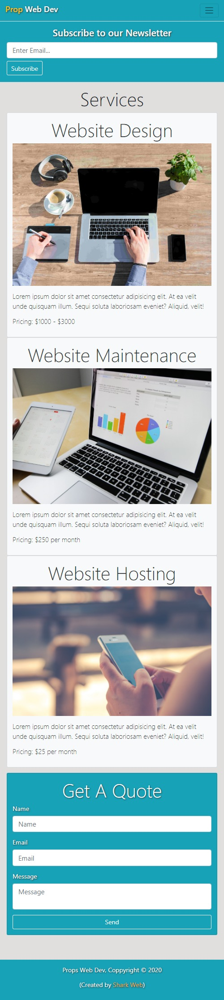

# Prop Web Dev

A website UI for a fictional website development company called "Prop Web Dev". This site UI was built using HTML, CSS, [bootstrap](https://bootstrap.com), [font awesome](https://fontawesome.com) and [dynamic drive favicon generator](https://tools.dynamicdrive.com/favicon).

## Page Layouts

- Hompage Desktop view

- Hompage Mobile view

- About Desktop view

- About Mobile view

- Services Desktop view

- Services Mobile view

## Author(s)

- [stevemarcel](https://github.com/stevemarcel)
